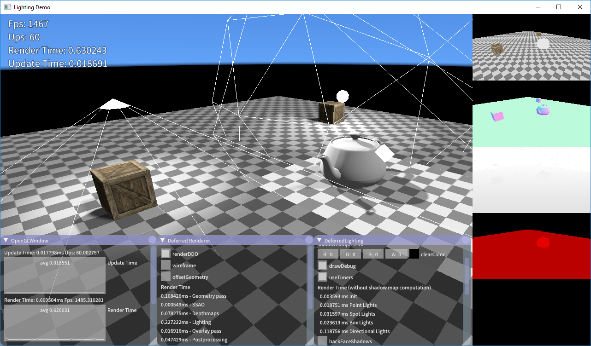
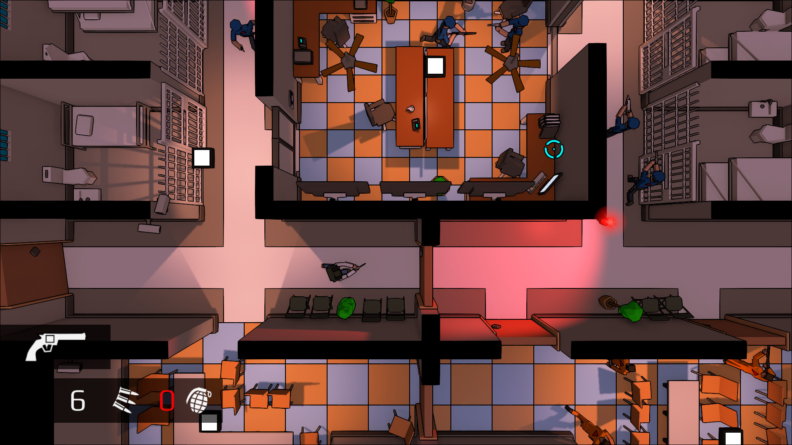

# SAIGA

Saiga is a lightweight utility and rendering framework. 
It supports all major desktop operating systems and provides OpenGL and Vulkan rendering backends.
Saiga was successfully used as a game engine for [Redie](http://store.steampowered.com/app/536990/) and in many privat and university projects.

  

## History

 * January 2014: Development start as a private OpenGL framework for university projects.
 * September 2015: The name SAIGA was chosen as a reference to the [saiga antelope](https://en.wikipedia.org/wiki/Saiga_antelope).
 * April 2014 - December 2016: Development of the game [Redie](http://store.steampowered.com/app/536990/). In this time most of SAIGA's functionality was added so it could be used as a lightweight game engine.
 * January 2017 - August 2017: Increased usability and documentation in preparation of the open source release.
 * August 2017: Open-Source Release.
 * September 2018: Experimental Vulkan support.
 * December 2018: Added Vision module with focus on SLAM, Reconstruction, Registration, and Optimization

 
## Supported Compilers

 * g++ 8.2
 * Visual Studio 2017
 * clang++ 7.0

Master | Experimental 
--- | --- 
[](https://travis-ci.org/darglein/saiga)  | [](https://travis-ci.org/darglein/saiga)  

## Required Dependencies

 * OpenGL 3.3
 * [GLM 0.9.9-a2](https://github.com/g-truc/glm/tree/0.9.9-a2)

## Optional Dependencies

Window creation and GL-Context managment
 * [SDL](https://www.libsdl.org/)
 * [GLFW](http://www.glfw.org/)
 * [Mesa EGL](https://www.mesa3d.org/egl.html)
 
Sound loading and playback
 * [OpenAL](https://openal.org/)
 * [ALUT](http://distro.ibiblio.org/rootlinux/rootlinux-ports/more/freealut/freealut-1.1.0/doc/alut.html)
 * [Opus](http://opus-codec.org/)
 
Video Recording
 * [FFMPEG](https://ffmpeg.org/)
 
Model Loading
 * [ASSIMP](https://github.com/assimp/assimp)
 
Image/Font loading
 * [PNG](http://www.libpng.org/pub/png/libpng.html)
 * [FreeImage + FreeImagePlus](http://freeimage.sourceforge.net/)
 * [freetype](https://www.freetype.org/)
 
Utility
 * [Eigen](http://eigen.tuxfamily.org)
 * [CUDA](https://developer.nvidia.com/cuda-downloads)
 
 Vulkan
 * [LunarG SDK](https://www.lunarg.com/vulkan-sdk/)
 * [GLSLANG](https://github.com/KhronosGroup/glslang)

## Building + Running the samples

#### Building With Submodules

```
sudo apt install xorg-dev

git clone git@github.com:darglein/saiga.git
git submodule update --init --recursive
``` 

#### Linux
 - Install dependencies with the package manager (in older Linux systems you might have to compile the latest library versions by yourself)

   Package names for Ubuntu and other Debian-based distributions. Install these with `sudo apt install <package_name>`
```
# Window Management
libglfw3-dev

# Image
libpng-dev libfreeimage-dev libfreeimageplus-dev

# Sound
libopenal-dev libopus-dev libopusfile-dev

# Video 
libavutil-dev libavcodec-dev libavresample-dev libswscale-dev libavformat-dev

# Other Misc
libassimp-dev 
libeigen3-dev 
libsuitesparse-dev
libfreetype6-dev
```

 - Build Saiga
```
cd saiga
mkdir build
cd build
cmake ..
make
```

## License

SAIGA is licensed under the MIT License. See LICENSE file for more information.


